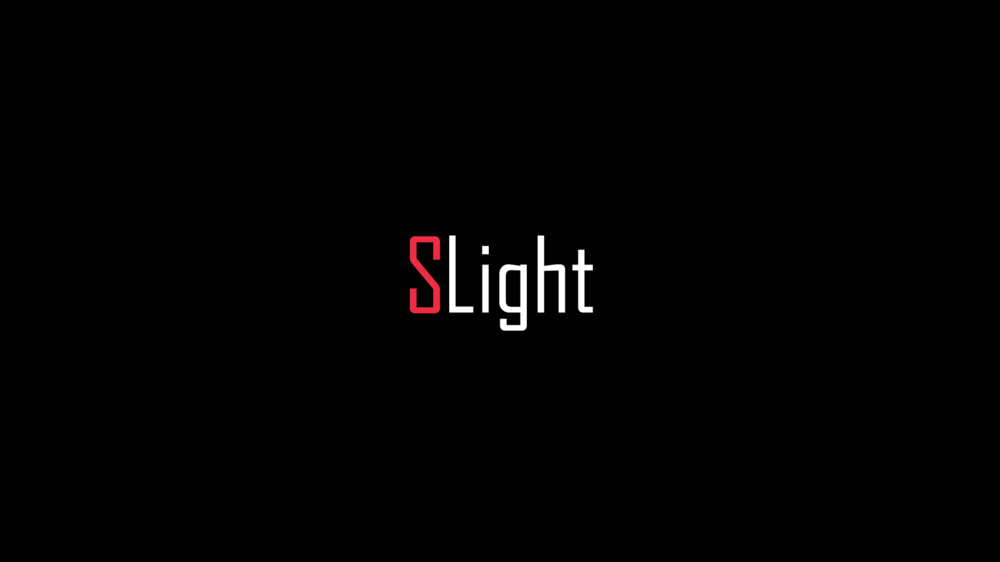
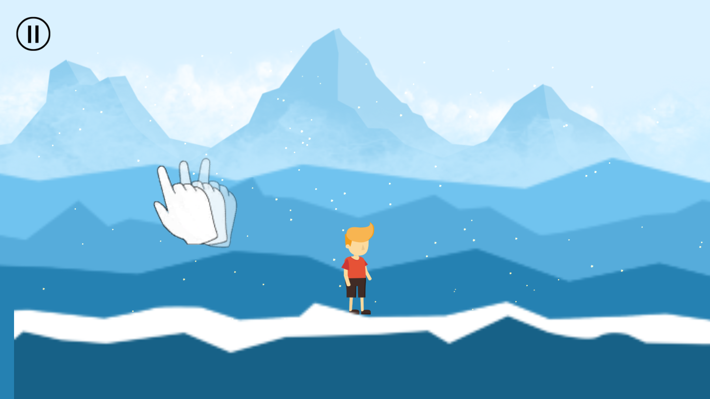
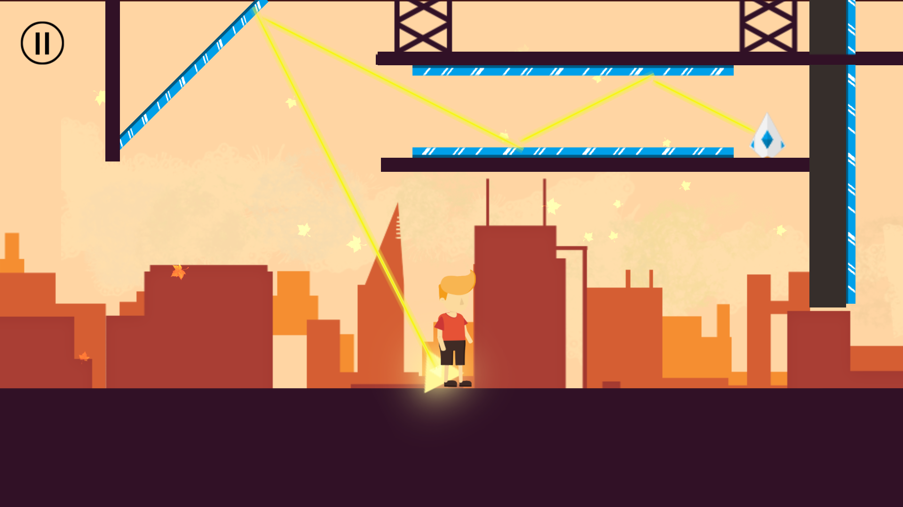
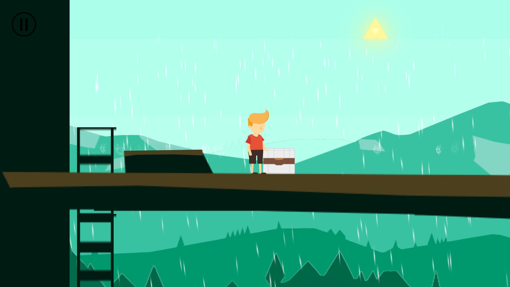
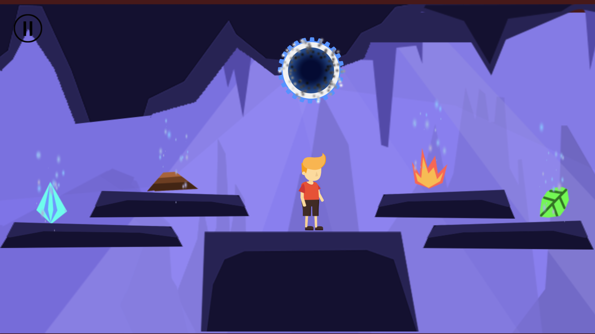

## SLight

##### 简介
一款2D横板平台解谜游戏

##### 运行方式
使用Unity打开本项目，在Unity中选择Scene/InitScene场景，运行即可

##### 游戏截图
* Splash界面：  

* 选关界面：  

* 关卡截图：  
    * 教学关：  

    * 第一关：  
  
    * 第二关：  
  
    * 第三关：  
  

